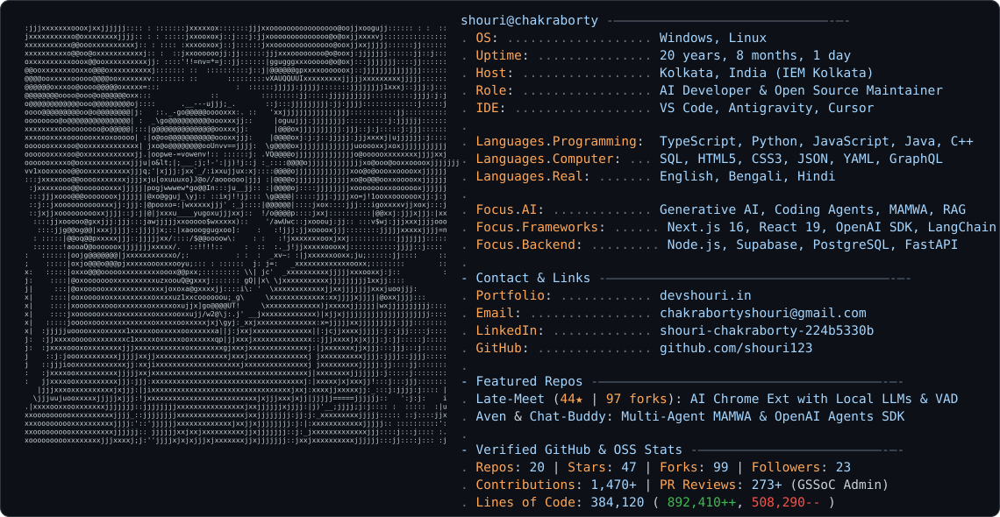

<picture>
  <source media="(prefers-color-scheme: dark)" srcset="dark_mode.svg" />
  <source media="(prefers-color-scheme: light)" srcset="light_mode.svg" />
  
</picture>

```text
shouri@chakraborty
--------------------------------------------------
. OS: .................. Windows, Linux
. Location: ............ Kolkata, India
. Role: ................ GenAI & Agentic Systems Developer
. IDE: ................. VS Code, Cursor, Antigravity

. Languages.Coding: .... Python, C++, C, JavaScript
. Languages.Web/Data: .. SQL, HTML, CSS, JSON, YAML
. Languages.Human: ..... English, Bengali, Hindi

. Focus.AI: ............ Agentic Systems & LLM Tool-Use
. Focus.Frameworks: .... PyTorch, MCP, FastAPI, Supabase

- Contact ----------------------------------------
. Email: ............... chakrabortyshouri@gmail.com
. LinkedIn: ............ shouri-chakraborty-224b5330b
. GitHub: .............. shouri123

- Engineering Philosophy -------------------------
. Building autonomous AI agents, tool reasoning,
. and NLP systems with zero fluff.
```
