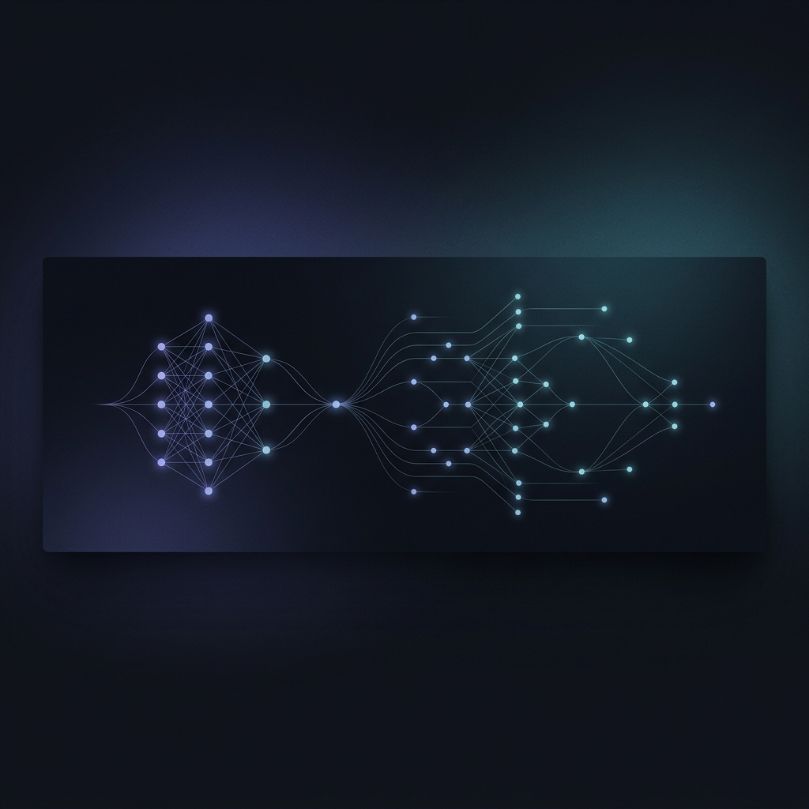
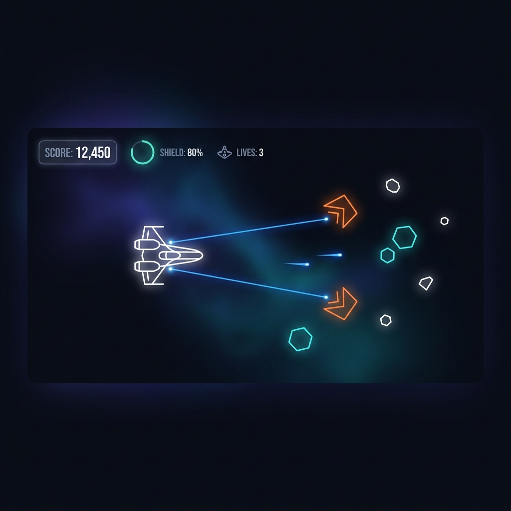

<p align="center">
  
</p>

<div align="center">

# Shouri Chakraborty

### **Building Autonomous AI Agents, GenAI Systems & Developer Tools**

*Engineering agentic workflows, LLM tool-use architectures, and NLP systems.*

<br>

[](https://www.linkedin.com/in/shouri-chakraborty-224b5330b/)
[](mailto:chakrabortyshouri@gmail.com)
[](https://github.com/shouri123)

---

</div>

## ⚡ About & Engineering Philosophy

I focus on bridging the gap between cutting-edge AI research and production-grade developer tooling. My work centers around **autonomous agents**, **tool-augmented LLM reasoning**, and **NLP systems** designed for developer productivity.

- 🤖 **Focus**: Multi-agent orchestration, Model Context Protocol (MCP), and reasoning workflows.
- 💡 **Philosophy**: Clean code, zero fluff, measurable impact, and human-centric AI tools.

---

## 🎯 Featured Flagship Work

<div align="center">

| 🤖 **Autonomous AI Workflows & Agentic Systems** |
| :--- |
| **Problem**: Standard LLM pipelines lack contextual memory and autonomous multi-tool execution capability.<br>**Solution**: Built an agentic framework featuring context management, dynamic tool invocation, and low-latency reasoning.<br><br>**Tech Stack**: `Python` • `PyTorch` • `Model Context Protocol (MCP)` • `FastAPI` • `Supabase`<br><br>👉 **[Explore Projects & Codebase →](https://github.com/shouri123)** |

</div>

---

## 🏆 Open Source Impact & Live Activity

<table width="100%">
<tr>
  <td width="50%" valign="top">
    <h4>📈 Open Source Metrics & Impact</h4>
    <ul>
      <li><b>Open Source Maintainer & Contributor</b></li>
      <li><b>Active Pull Requests & Code Reviews</b></li>
      <li><b>Agentic Systems & AI Tooling Focus</b></li>
    </ul>
  </td>
  <td width="50%" valign="top">
    <h4>🔥 Recent Activity Feed</h4>

<!-- RECENT_ACTIVITY:START -->
*Automatically updated via GitHub Actions*
<!-- RECENT_ACTIVITY:END -->

  </td>
</tr>
</table>

---

## 🕹️ Creative Systems & Graphics

<p align="center">
  
</p>

*Minimalist dark-mode game graphics & vector engine experiments.*

---

## 🚀 Currently Building & Exploring

```text
┌── CURRENT FOCUS (2026) ────────────────────────────────────────────────────────┐
│  • Agentic Workflows    → Contextual memory & tool-use reasoning              │
│  • MCP Integrations     → Protocol handlers for developer agents              │
│  • LLM Optimization     → Quantization, prompt engineering, fine-tuning       │
└────────────────────────────────────────────────────────────────────────────────┘
```

---

## 🛠️ Tech Stack & Architecture

<table width="100%">
<tr>
  <td width="33%" valign="top">
    <h4>🤖 AI / ML & Agents</h4>
    <ul>
      <li>Python / PyTorch</li>
      <li>LLM Tool-Use & Agents</li>
      <li>NLP & GenAI Systems</li>
      <li>scikit-learn / TensorFlow</li>
      <li>Pandas & NumPy</li>
    </ul>
  </td>
  <td width="33%" valign="top">
    <h4>💻 Core Systems</h4>
    <ul>
      <li>Python / C++ / C</li>
      <li>JavaScript / TypeScript</li>
      <li>MySQL / Supabase</li>
      <li>Git / GitHub Actions</li>
      <li>REST & Microservices</li>
    </ul>
  </td>
  <td width="33%" valign="top">
    <h4>🌐 Web & Deployment</h4>
    <ul>
      <li>React / Vite</li>
      <li>Flask / FastAPI</li>
      <li>HTML5 & CSS3</li>
      <li>Vercel / Render</li>
      <li>Windows Terminal</li>
    </ul>
  </td>
</tr>
</table>

---

## 📊 Engineering Metrics & Activity

<div align="center">

| 📊 **GitHub Activity** | ⚡ **Top Languages** |
| :---: | :---: |
|  |  |

</div>

---

<p align="center">
  <sub>Designed with minimalism • Open for AI research & engineering collaborations</sub>
</p>
